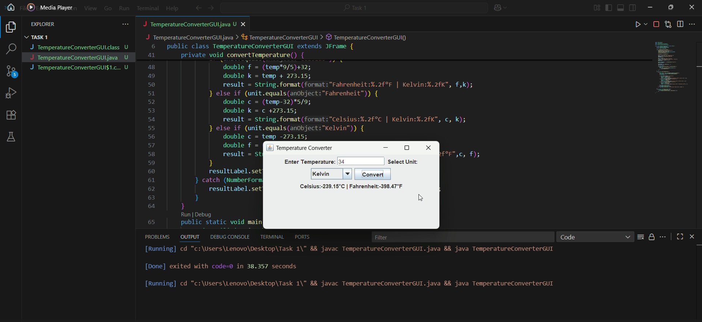

# PRODIGY_SD_01
The Temperature Converter Application is developed in Java using Swing and AWT libraries.
It provides a user-friendly graphical interface where users can enter a temperature value, select the input unit (Celsius, Fahrenheit, or Kelvin) from a dropdown menu, and click a button to convert.
The program applies standard mathematical formulas to convert the input value into the other two temperature units.
Results are displayed dynamically on the screen using labels, ensuring clarity and ease of understanding.
If the user enters invalid input, the program handles the error gracefully by showing an appropriate message instead of crashing.
This project demonstrates the use of GUI development in Java, event handling with ActionListener, and exception handling for input validation.
